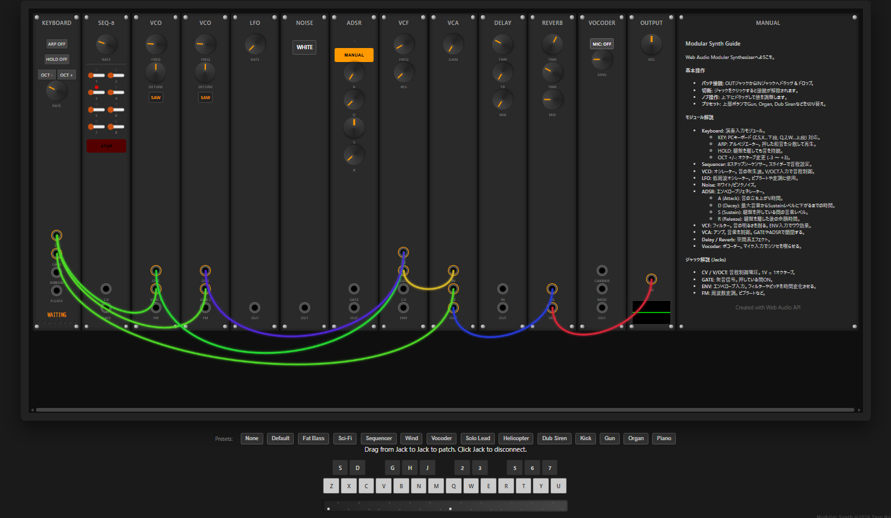

# Modular Synth (Ver.1.0)

ブラウザ上で動作する本格的なアナログモジュラーシンセサイザーのシミュレーションアプリケーションです。
Web Audio API と AudioWorklet を活用し、ケーブルパッチングによる自由度の高い音作りが可能です。

## 🌐 オンラインデモ

**[https://nakasendo.com/modularsynth](https://nakasendo.com/modularsynth)**

## 📸 画面イメージ



*(リポジトリルートに `screenshot.png` を配置するとここに表示されます)*

## ✨ 特徴

- **完全なパッチング機能**: マウスドラッグでジャック間をケーブル接続
- **豊富なモジュール**:
  - **音源**: VCO (Dual), Noise
  - **制御**: Keyboard, Sequencer, LFO, ADSR Envelope
  - **フィルター & アンプ**: VCF (Ladder Filter), VCA
  - **エフェクト**: Delay, Reverb, Vocoder
- **プリセット搭載**: 即座に音が出せる多数のプリセット（Bass, Lead, Sci-Fi, Hecicopterなど）
- **モダンなUI**: レスポンシブで直感的なダークモードデザイン

## � 取扱説明書

### 1. 基本操作

*   **パッチング（ケーブル接続）**:
    *   モジュールの **OUT（出力）** ジャックから、別のモジュールの **IN / CV / GATE（入力）** ジャックへマウスをドラッグ＆ドロップするとケーブルが繋がります。
    *   **ケーブル削除**: 接続されているジャックをクリックすると、その接続が解除されます。
*   **ノブ（つまみ）の操作**:
    *   ノブの上でマウスをクリックしたまま **上下にドラッグ** すると値を変更できます。
*   **プリセットの使用**:
    *   画面下部のボタン（Default, Bass, Sci-Fi...）を押すと、代表的なパッチング設定が自動的に読み込まれます。
    *   **ヒント**: まずはプリセットを切り替えて、どのような音が作れるか試してみるのがおすすめです。

### 2. 各モジュールの役割

*   **KEYBOARD (鍵盤)**: 
    *   **CV**: 押した鍵盤の音程信号（1V/Oct）を出力します。VCOの V/OCT に繋ぎます。
    *   **GATE**: 鍵盤を押している間だけONになる信号を出力します。ADSRの GATE に繋ぎます。
*   **VCO (オシレーター)**: 音の波形（Saw/Square/Sine/Tri）を作ります。シンセサイザーの心臓部です。
    *   **FREQ**: 周波数を変えます。
    *   **V/OCT**: 音程を制御する入力です。
*   **VCF (フィルター)**: 音の明るさを変えます。
    *   **FREQ**: カットオフ周波数。これを下げるとこもった音になります。
    *   **RES (Resonance)**: カットオフ付近を強調し、癖のある音にします。
*   **VCA (アンプ)**: 音量を制御します。
    *   **CV**: ここに入力された信号（エンベロープなど）に応じて音量が変化します。
*   **ADSR (エンベロープ)**: 音の時間的変化を作ります。
    *   **A (Attack)**: 立ち上がりの速さ。
    *   **D (Decay)**: 最大音量から下がる速さ。
    *   **S (Sustain)**: 鍵盤を押し続けている間の音量レベル。
    *   **R (Release)**: 鍵盤を離した後の余韻の長さ。
*   **LFO (低周波発振器)**: 音をゆっくり揺らします。ビブラートやトレモロなどに使用します。
*   **SEQUENCER**: 自動演奏を行うためのパターンを作ります。
*   **EFFECTS (エフェクト)**:
    *   **Delay**: やまびこ効果を加えます。
    *   **Reverb**: 空間的な広がり（残響）を加えます。
    *   **Vocoder**: マイク入力（要許可）とシンセ音を合成し、ロボットボイスを作ります。
*   **OUTPUT**: 最終的な音の出口です。**ここに繋がないと音が出ません。**

### 3. 音作りの基本（パッチング例）

最も基本的な「鍵盤を押して音を出す」設定は以下の通りです：

1.  **音程**: `KEYBOARD [CV]` → `VCO [V/OCT]`
2.  **発音タイミング**: `KEYBOARD [GATE]` → `ADSR [GATE]`
3.  **音の流れ**: `VCO [OUT]` → `VCF [IN]` → `VCF [OUT]` → `VCA [IN]` → `VCA [OUT]` → `OUTPUT [IN]`
4.  **音量の制御**: `ADSR [OUT]` → `VCA [CV]`

これによって、鍵盤を押したときだけ音が鳴り、離すと消えるという基本的な楽器の挙動になります。

## �🛠️ 開発と実行

### セットアップ

```bash
npm install
```

### ローカル開発サーバーの起動

```bash
npm run dev
```
ブラウザで `http://localhost:5173` にアクセスしてください。

### 公開用ビルド

IISなどのWebサーバーへ配置するための静的ファイルを生成します。

```bash
npm run build
```

`dist` フォルダが作成されます。この中のファイルをWebサーバーの公開ディレクトリにコピーしてください。

## 🤖 開発環境

このプロジェクトは、AIコーディングアシスタント **Antigravity** を使用して開発されました。

## 📜 ライセンス

このプロジェクトは [MIT License](https://opensource.org/licenses/MIT) のもとで公開されています。

## © コピーライト

&copy; 2026 Taro Nakasendo
